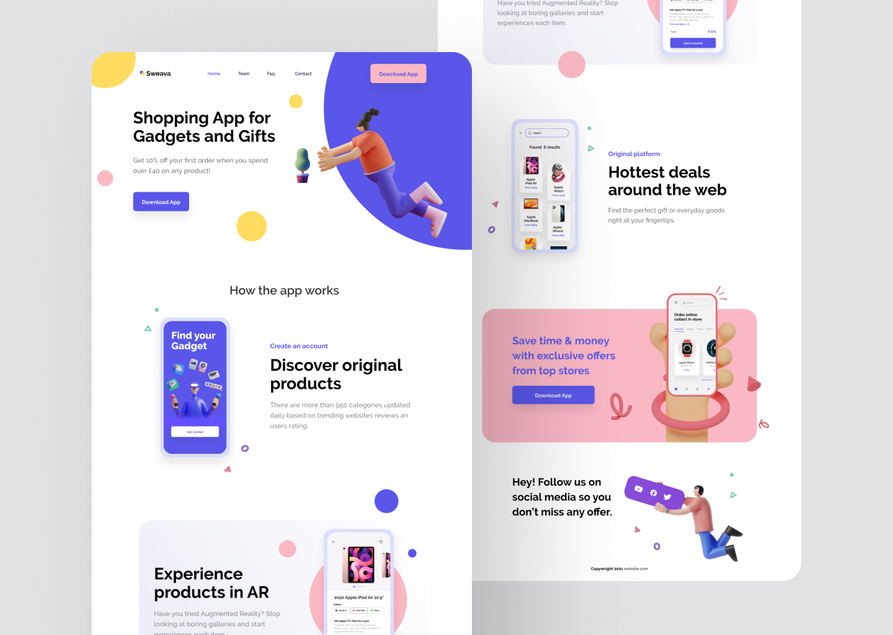

# Sweava Ecommerce

## 💻️ Technologies Used
In this project I used as base:

- HTML
- SCSS/SASS
- JavaScript

And some others like:

- Google Fonts

## 📝️ The Project
This project consists of a mobile first landing page that is about introducing Sweava, an ecommerce app.

## 🌐️ How to Access
Being a web page it is very easy to access. Just enter [this link](https://pedrohsfontoura.github.io/sweava-ecommerce) and see the project online.

## 📜 Credits
The project was made using the assets of [Rosina Pissaco](https://dribbble.com/rosinapissaco)

---

Made with 💜️ by Pedro Fontoura

